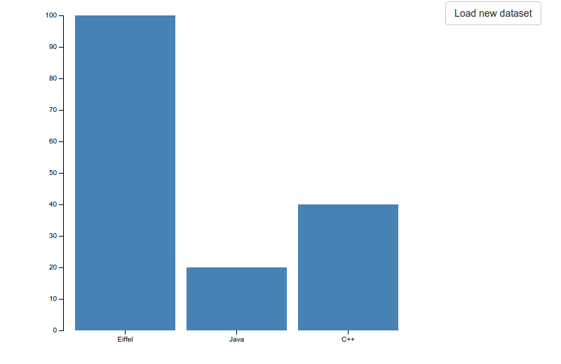

EWF JS WIDGET Custom PROJECT
============================


Getting Started
- Copy and rename the custom-template folder

How to create a custom JS-WIDGET

#Introduction
The main goal of this module is to provide easy to use javascript/html widget (controls), which allow the developer to build dynamic interfaces without the need to code javascript code. The wsf_js_widget module creates the illusion of a shared state between client and server, this illusion is created by restoring the clients state in the beginning of each request.

The wsf_js_widget module provides so called "statefull" controls which can be modified on callback (when a callback event is triggered e.g the client presses a button). The callbacks can be fully defined in Eiffel using agents.

#Goal
The goal of this tutorial is to build a custom js widget control. We will build a simple bar chart which can be modified by the server. The javascript implementation is based on the javascript library d3. http://bl.ocks.org/mbostock/3885304



# Step 1
First we define the state which is shared between the client and the server. The bar chart data can be represented as a key value hashmap, but since the json standard does guarantee the key order, we will use a JSON list  containing objects with the key and the value.

[{"key":"Eiffel", "value":12}, {"key":"C#", "value":12}, {"key":"Java", "value":12}]


#Step 2
Based on the shared state we now can start the Eiffel implementation of the control.

## Basic WSF Control structure
```EIFFEL
class
	WSF_BARCHART_CONTROL

inherit

	WSF_CONTROL
		rename
			make as make_control
		end

create
	make

feature {NONE} -- Initialization

	make
		do
			make_control ("div")
		end

feature -- State handling

	set_state (new_state: JSON_OBJECT)
		do		
		end

	state: WSF_JSON_OBJECT
		do
			create Result.make
		end

feature -- Callback

	handle_callback (cname: LIST [STRING_32]; event: STRING_32; event_parameter: detachable ANY)
		do
				-- Do nothing here
		end

feature -- Rendering

	render: STRING_32
		local
			temp: STRING_32
		do
			Result := render_tag ("Loading ...", "")
		end

end
```
Now we can create the set data functions. This step is straight forward:
* We add the data structure to the class.

* Create a setter function which registers the change in the state_changes json object. This object is used to pass the state changes which happen in a call back to the browser. 

* Since the list of tuples is not a primitiv data type we need a function which translates the data as a json object. 

### Code changes
```EIFFEL
feature -- Data

	set_data (a_data: like data)
		do
			data := a_data
			state_changes.replace (data_as_json, "data")
		end

	data_as_json : JSON_ARRAY
	local
		item: WSF_JSON_OBJECT
	do
		create Result.make_array
		across
			data as el
		loop
			create item.make
			if attached {STRING_8} el.item.at(1) as key and attached {DOUBLE}el.item.at(2) as value then
			item.put_string (key, "key")
			item.put_real (value, "value")
			Result.add(item)
			end
		end
	end
	data: ARRAY [TUPLE [STRING_8, DOUBLE]]
```
The state handling is still missing. We need to restore the state, because the objects are recreated on each callback. 


```EIFFEL
	set_state (new_state: JSON_OBJECT)
			-- Restore data from json
		do
			if attached {JSON_ARRAY} new_state.item ("data") as new_data then
				create data.make_filled (["",0.0], 1, new_data.array_representation.count)
				across
					new_data.array_representation as d
				loop
					if attached {JSON_OBJECT} d.item as citem
						and then attached {JSON_STRING} citem.item ("key") as key
						and then attached {JSON_NUMBER} citem.item ("value") as value then
						data.put ([key.item,value.item.to_real_64], d.cursor_index)
					end
				end
			end
		end

	state: WSF_JSON_OBJECT
			-- Return state with data
		do
			create Result.make
			Result.put (data_as_json, "data")
		end

```
Before starting the javascript development part we add the control to the page. 

```EIFFEL
	initialize_controls
		do
			Precursor
			-- Bind custom.js
			add_javascript ("assets/custom.js")
			navbar.set_active (1)
			-- Define colum 12/12
			main_control.add_column (6)
			main_control.add_column (6)
			create chart.make
			chart.set_data (<<["Eiffel",100.0],["Java",20.0],["C++",40.0]>>)
			main_control.add_control (1,chart)

			-- Create button
			create button.make ("Load new dataset")
			button.set_click_event (agent do
				chart.set_data (<<["Eiffel",120.0],["Java",60.0],["C#",30.0],["Python",230.0]>>)
			end)
			--Add button control
			main_control.add_control (2,button)
		end
```
## Javascript Part
The part of the application an be written in javascript or any language which compiles to javascript. We decided to use coffescript beacuse it is simpler to define classes.

- Create a file assets/graph.css
```CSS
.bar {
  fill: steelblue;
}

.bar:hover {
  fill: brown;
}

.axis {
  font: 10px sans-serif;
}

.axis path,
.axis line {
  fill: none;
  stroke: #000;
  shape-rendering: crispEdges;
}

.x.axis path {
  display: none;
}
```

- Create a file assets/custom.coffee
- Start cofffescript compiler `coffee -cbw widget.coffee`

First we create a class with the same name like the Eiffel class. If the control has any external dependencies we can add these dependencies in a JSON array with the name `requirements`. All the javascript and css files referenced in this array will be loaded before the attach_events function is executed. Already loaded dependencies will not be reloaded. 

```CoffeeScript
	class WSF_BARCHART_CONTROL extends WSF_CONTROL
		requirements: ['/assets/d3.min.js', '/assets/graph.css']
```
After loading the dependencies the attach_events function is executed. In this function we need to attach_events the d3 graph. @$el is a jquery object which refrences the DOM element of the current control.

```CoffeeScript
	attach_events: ()->
		super
		margin =
			top: 20
			right: 20
			bottom: 30
			left: 40

		#Clear
		@$el.html("")
		#Calculate width
		width = @$el.width() - margin.left - margin.right
		height = 500 - margin.top - margin.bottom
		#Create axis
		x = d3.scale.ordinal().rangeRoundBands([
			0
			width
		], .1)
		y = d3.scale.linear().range([
			height
			0
		])
		@xAxis = d3.svg.axis().scale(x).orient("bottom")
		@yAxis = d3.svg.axis().scale(y).orient("left").ticks(10)
		svg = d3.select(@$el[0]).append("svg")
			.attr("width", width + margin.left + margin.right)
			.attr("height", height + margin.top + margin.bottom)
			.append("g")
			.attr("transform", "translate(" + margin.left + "," + margin.top + ")")
		
		#Store svg, x and y scale in class so we can update the domain if a callback occures
		@x = x
		@y = y
		@svg = svg
		@height = height
		@xAxis_container = svg.append("g")
			.attr("class", "x axis")
			.attr("transform", "translate(0," + height + ")")
		@yAxis_container = svg.append("g")
			.attr("class", "y axis")
		#Call build graph to load the graph data
		@updatechart()

	updatechart: ()->
		height = @height
		data = @state.data
		x = @x
		y = @y
		#Set domain
		x.domain data.map((d) ->
			d.key
		)
		y.domain [
			0
			d3.max(data, (d) ->
				d.value
			)
		]
		#Update axis
		@xAxis_container.transition().duration(1000).call @xAxis
		@yAxis_container.transition().duration(1000).call @yAxis
		#Map data
		rect = @svg.selectAll(".bar")
			.data(data, (d)-> d.key)
		#Add new bars
		rect.enter()
				.insert("rect")
					.attr("class", "bar")
					.attr("x", (d) ->
						x d.key
					)
					.attr("width", x.rangeBand())
					.attr("y", (d) ->
						height
					)
					.attr "height", (d) ->
						0
		#Adjust bar positions and sizes
		rect.transition().duration(1000).attr("x", (d) ->
				x d.key
			)
			.attr("width", x.rangeBand())
			.attr("y", (d) ->
				y d.value
			)
			.attr "height", (d) ->
				height - y(d.value)
		#Animate exiting bars
		rect.exit().transition().duration(1000)
			.style('opacity', 0)
			.attr("height", (d) ->
				0
			).attr("y", (d) ->
				height
			).remove()


```
The last part which is still missing. Is the update state event handling. If the state is updated the update function is called with the new state as parameter. All we must do now is update the state object and call the updatechart function.

```CoffeeScript
	update: (state) ->
		if state.data != undefined
			@state['data'] = state.data
			data = state.data
			@updatechart()

```
